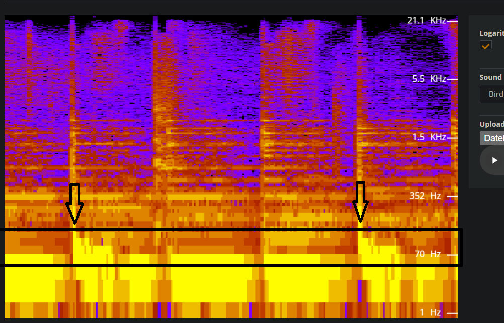
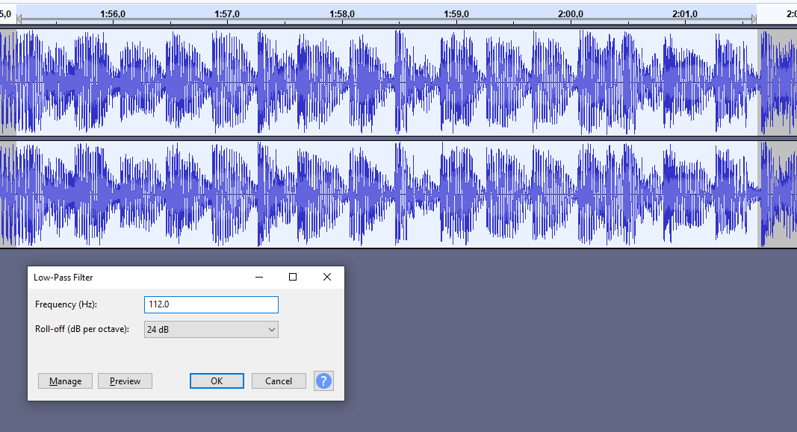
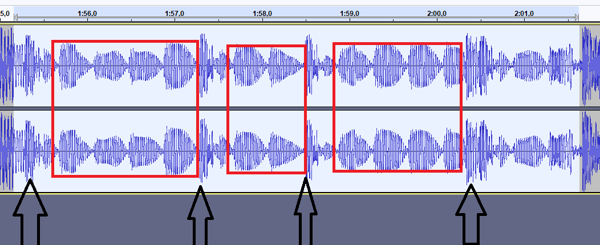
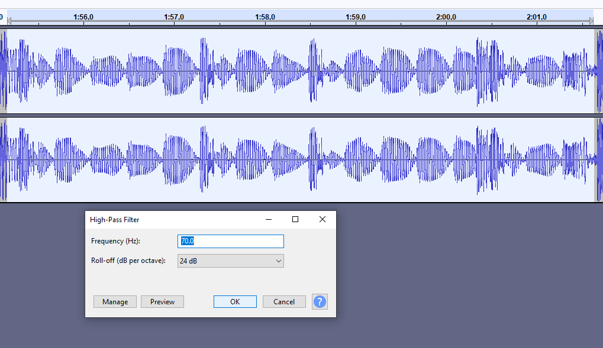
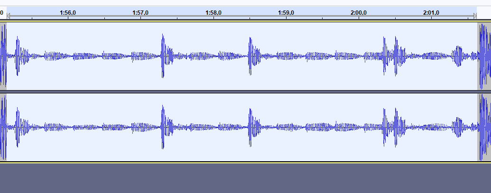
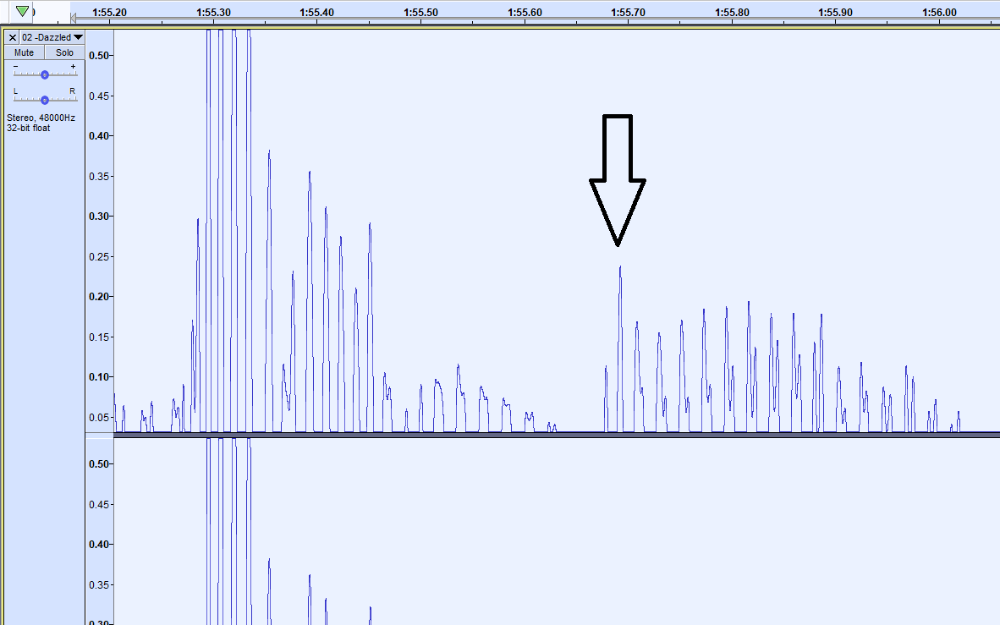

# Guide to Audio Reactivity

PyTTI provides audio reactivity in the form of arbitrary bandpass filters, the signal amplitude of which gets passed into the animation functions.

## What's audio reactivity?

In PyTTIs context, audio reactivity describes an animation reacting to an audio input.

In order for PyTTI to generate animations that react to audio, 3 parts are necessary:

- an audio file PyTTI should react to
- one or more [bandpass filter](https://en.wikipedia.org/wiki/Band-pass_filter) parameters to run on that audio, including a variable name. For filtering out different elements from the audio.
- an animation function (see also: [Settings](Settings#motion-controls)) that uses the variable name you declared, for generating motion in the resulting video based on your audio.

## Simple Example: reacting to drum beat audio

We can use a simple drum beat for our audio input. Here's a classic example: The Amen Break (audio from [Wikipedia](https://en.wikipedia.org/wiki/File:The_Amen_Break,_in_context.ogg))

<audio controls src="https://upload.wikimedia.org/wikipedia/en/8/80/The_Amen_Break%2C_in_context.ogg">
</audio>

If we want to generate an animation that reacts to just the kick drum, we can just guesstimate the frequency range of the kick drum.

For a general ballpark figure of various percussion pieces, you can look up frequency ranges of various instruments, like [this](https://www.zytrax.com/tech/audio/audio.html) table quoting a range of 60Hz-100Hz for a kick drum.

Using this information we can configure our example scenario:

```yaml
input_audio: /path/to/The_Amen_Break,_in_context.ogg
# We want to skip the lead-in context with the brass instruments, so we just skip the first 5 seconds.
input_audio_offset: 5
input_audio_filters:
- # The name of the variable we will use in the animation function
  variable_name: fLo
  # We just use an arbitrary frequency from the range quoted above (80Hz)
  f_center: 80
  # The filter will pass signals from 70Hz to 90Hz
  f_width: 20
  # The filter slope will be 6*6=36dB per octave
  order: 6

scenes: the winsons performing the song "Amen, Brother", oil on canvas, trending on ArtStation

# We want a 3D animation
animation_mode: 3D
# Move in the x direction when the kick drum hits
translate_x: 'fLo*150'
# Move in the y direction when the kick drum hits
translate_y: 'fLo*150'
# Zoom in the z direction when the kick drum hits
translate_z_3d: 'fLo*150'

# Just generate a rough sketch at low resolution with low framerate for quick generation
width: 640
height: 480
frames_per_second: 15
```

Running this scenario, we get a rough, audio-less video using PyTTI. We can then concatenate this with the audio to create a animated video:

```shell
# offset the audio by 5s, then offset the output by 5s and render a total length of 10s of video.
ffmpeg -itsoffset 5 -i videos\basic_test.mp4 -i path\to\The_Amen_Break,_in_context.ogg -c:a copy -c:v libx264 -ss 00:00:5.0 -t 00:00:10.0 basic_test_sound.mp4
```

<video src='_static/amen_break_example.mp4' width=480 controls></video>


## Advanced Example: beat detection using bandpass filters

It may seem like a daunting task to perform rudimentary beat detection just using filters. However, with some basic knowledge about audio signals, we can easily make PyTTI animations "dance" to the input audio rather accurately.

For this example, we will implement a simple "beat detection" type of animation, where the animation will react simply to the kick drum in a song.

### Analyzing audio: spectrogram view

In order to do this, we will need to understand the audio spectrum of our song in its basic form.
There are several tools that can be helpful here.

Some rudimentary tools to view the spectrogram of any song include [this spectrum analyzer on academo](https://academo.org/demos/spectrum-analyzer/) and [Audacity's spectrogram view](https://manual.audacityteam.org/man/spectrogram_view.html#select).
Note: Make sure to use a logarithmic frequency scale in any case, as the frequency of a kickdrum usually lies very low on the spectrum and is difficult to observe on a linear frequency scale.

Users of DAWs will also be able to use their respective workstations builtin tools to perform this task.



### Analyzing audio: honing in on the frequency band of the kick drum

For many genres, you may be able to figure out the kick drum's frequency range by simply looking at the spectrogram already.
When playing the audio, you may be able to simply see the change in amplitude in the lower bass frequency range (~40-100Hz typically) and set your bandpass filter parameters based on that.

However, if you want to or need to hone in more accurately on the exact band the kick drum, you will need to perform some additional analysis.

If you are using a DAW, this is easily done throwing an EQ with a bandpass filter on your audio and sweeping through the spectrum, honing in on the spot where the output amplitude most accurately reflects the kick drum signal.
For additional context when working with a parametric EQ: the butterworth order can also be easily understood in a typical parametric EQ as the dB/octave parameter: A single butterworth filter-order corresponds to a 6dB/octave slope on the filter, thus a 5th order butterworth filter has a 30dB/octave slope.

If you are using audio editing tools like Audacity, you can use its builtin filtering tools for testing your filter parameter's quality.

First, apply a low-pass filter with a frequency of `f_center+(f_width/2)` and a slope close to the `order` of your desired filter. If you've used the spectrogram until now, you can just guesstimate and progressively get close to the optimal `f_center` and `f_width` (or simply, upper bound) here and start with a 24dB/octave filter.



If you've chosen a good value for the upper frequency bound, you may already observe that the peaks of the amplitude now roughly resemble where the kick drums in the song are located.



However, in this example, which is an electronic song with a deep sub bass, marked in red, we also have some rhythmic bass notes that still have a high amplitude and would make our animation react to the kick drum too heavily.

To remedy this, we now apply the lower frequency bound of our bandpass filter, by applying a high-pass filter to the signal, at the `f_center-(f_width/2)` frequency. If we want to use the filter order we also used in Audacity, it would be `order=24/6=4` here, as we chose a 24db/octave filter slope.



After applying this filter, if the frequency was chosen well, the amplitude of the bass notes should be greatly reduced:



If the signal now resembles the kick drum rhythm relatively accurately (the result above is OK enough to move on), we can now start building animation functions with the filter parameters we chose.

For this example, we chose `(70+112)/2=91` as our `f_center` and `(112-91)*2=42` as our `f_width`.

### Using the signal in animation functions

As you can see in the example amplitude plot, we still have some residual bass signal in our amplitude output, even after all this filtering.

However, the difference in amplitude is significant enough to just deal with it in the animation function.

A simple trick to get rid of the residual signal is to use a function that is reminiscient of a ReLU function:
`max(fLo-undesired_peak, 0)`

To figure out the `undesired_peak` offset, which corresponds to the peak of the undesired signal which we don't want our animation influenced by, we can simply normalize our filtered audio to 0dB (this is what the PyTTI does internally to give you a full `[0..1]` range of input values from the filtered signal), zoom in to the amplitude peak of the residual signal, and use the amplitude value as the `undesired_peak` offset.



For this example, we will use `max(fLo-0.25, 0)` as our motion induction parameter. Since this parameter now only covers the `[0, 0.75]` range, typically you would now multiply this with a larger factor to make sure the motion is visible in the final video.

The values here now depend on other parameters of your scenario like `field_of_view` as well, but generally it's a good idea to start with larger values (I'd recommend starting with ~200 for a FOV of 42 for example).

Here's the motion induction on the audio highlighted in the previous steps using these animation parameters:

```yaml
animation_mode: 3D

# Reacts to the beat and uses a tiny bit of smoothing using the `filter_var_prev` variable. This can be used to make the movement less abrupt. The 150*sin(1/4*t) motion scaling factor here also modulates over time to switch between translation in the x and y direction
translate_x: '(max(0, fLo-0.2)*0.6+max(0, fLo_prev-0.2)*0.4)*(150*sin(1/4*t))+0.5'
translate_y: '(max(0, fLo-0.2)*0.6+max(0, fLo_prev-0.2)*0.4)*(150*cos(1/3*t))-0.3'
# Some static zooming with the +55 addition and a static motion scaling factor of 150.
translate_z_3d: '(max(0, fLo-0.2)*0.6+max(0, fLo_prev-0.2)*0.4)*150+55'

# A continuous slight rotation that slowly changes direction over the course of the animation
rotate_3d: '[0.9999, 0.002*sin(1/5*t), 0, -0.001*cos(1/4*t)]'

lock_camera: false
# To make sure we get a decent depth of field
field_of_view: 42
# AdaBins adjustment
near_plane: 20
far_plane: 12000
```

<video src='_static/dazzled_cut.mp4' width=480 controls></video>


Of course, these concepts can now be applied to almost any characteristic in your audio. You can use filters to react to specific notes in a song, or make it react to other pieces of percussion.

## Other tips

### Plotting animation functions

If you want to make absolutely sure your animation function will work as expected, you can also plot a graph of how PyTTI will modulate your signal over time using this, admittedly very hacky, script (make sure to run it in PyTTIs conda environment):

```python
from pytti import AudioParse
import matplotlib.pyplot as plt
import numpy as np
import math

filter = type('', (), {})()
filter.variable_name='fLo'
filter.f_center = 84
filter.f_width = 30
filter.order = 5


func = 'max(0, fLo-0.25)*10'
filters = [
    filter
]

frames_per_second = 18

SAMPLERATE=44100

interval = 1/frames_per_second

offset = 0
parser = AudioParse.SpectralAudioParser('C:\\path\\to\\my\\audio.mp3', offset, frames_per_second, filters)

duration = parser.get_duration()

steps = int((duration - offset) / interval)

values = {}
for filter in filters:
    values[filter.variable_name] = np.array([], dtype=np.float64)

math_env = {
    "abs": abs,
    "max": max,
    "min": min,
    "pow": pow,
    "round": round,
    "__builtins__": None,
}
math_env.update(
    {key: getattr(math, key) for key in dir(math) if "_" not in key}
)
evald_values = np.array([], dtype=np.float64)

for i in range (0, steps):
    t = i * interval
    params = parser.get_params(t)
    for param in params:
        math_env[param] = params[param]
        values[param] = np.append(values[param], params[param])
    evald_values = np.append(evald_values, eval(func, math_env))

tx = np.linspace(0, steps, num=steps) * interval

for filter in filters:
    plt.plot(tx, values[filter.variable_name], label=f'raw_bp{filter.variable_name}')
plt.plot(tx, evald_values, label='func')

plt.show()
```